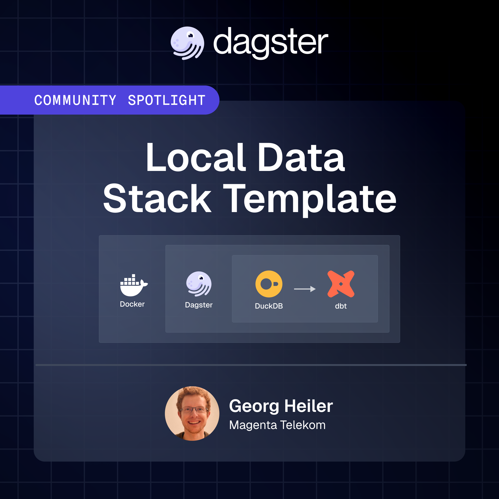

# local data stack template

This template brings together some of the best open-source tools in data engineering and Rust-based tooling for ensuring code quality:

- dagster, dbt, duckdb
- pixi
- docker
- ruff, pyright, taplo, pytest
- cruft

While the stack runs locally, it's designed with scale in mind.
Data and state accumulate over time (as data engineers say in partitions).
Slow data - similar to slow food, is healthy and allows the fast delivery of business value efficiently.

The idea of slow data refers to:

- focusing on the reduction of complexity
    - allows to reduce complex data pipelines down to a single developers notebook
    - making complex data pipeliens testable
- shipping real busines value fast
- scaling as needed via partitions and a scalable resource provider



The template directly can be deployed via docker-compose.
With only minimal adaptations you can instead deploy to kubernetes in any cloud provider.

Additionally included for secure handling of secrets:

- sops
- age

## usage

Prerequisites: 

- git
- an installation of cruft `pip install cruft jinja2-ospath`
- an installation of pixi https://pixi.sh/latest/#installation `curl -fsSL https://pixi.sh/install.sh | bash`
- text editor of choice such as vscode
- docker


```bash
curl -fsSL https://pixi.sh/install.sh | bash
git clone https://github.com/l-mds/local-data-stack.git
cd local-data-stack
pixi run tpl-init-cruft

# alternatively:
pip install cruft jinja2-ospath
cruft create git@github.com:l-mds/local-data-stack.git

cd <<your project name>>
git init
git add .
git commit -m "initial commit"

pixi update
git commit -m "set dependencies"

git commit -m "reformatting"
pixi run fmt

# start the data stack
pixi run start-dev
```

Post install:

- update the secrets in the `.env` files by executing: `openssl rand -base64 32` and setting a suitable secret
- ensure the `.env.enc` can be created by following the instructions in [documentation/secops]